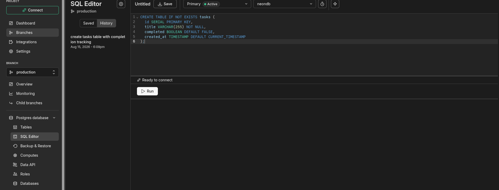
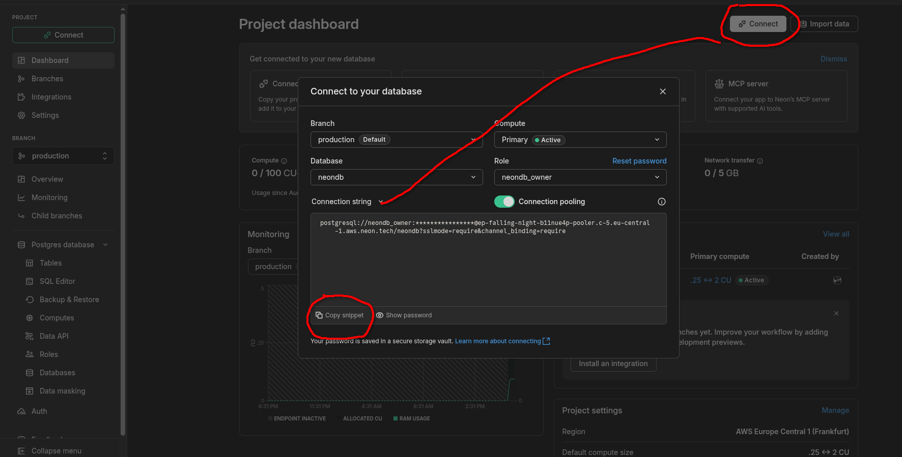

# nodejs

To install dependencies:

```bash
bun install
```

To run:

```bash
bun run index.ts
```

This project was created using `bun init` in bun v1.1.27. [Bun](https://bun.sh) is a fast all-in-one JavaScript runtime.

### 🗄️ Database Setup

1. **Create the Tasks Table:**
   Run the following query in your PostgreSQL database (e.g., via Neon SQL Editor or pgAdmin):

   ```sql
   CREATE TABLE tasks (
       id SERIAL PRIMARY KEY,
       title VARCHAR(255) NOT NULL,
       completed BOOLEAN DEFAULT FALSE,
       created_at TIMESTAMP DEFAULT CURRENT_TIMESTAMP,
       updated_at TIMESTAMP DEFAULT CURRENT_TIMESTAMP
   );
   ```

   

---

2. **Configure Environment Variables:**
   Update the `DATABASE_URL` in your `.env` file with your actual connection string:

   ```env
   DATABASE_URL="postgresql://<USER>:<PASSWORD>@<HOST>/<DB_NAME>?sslmode=require"
   ```

   
